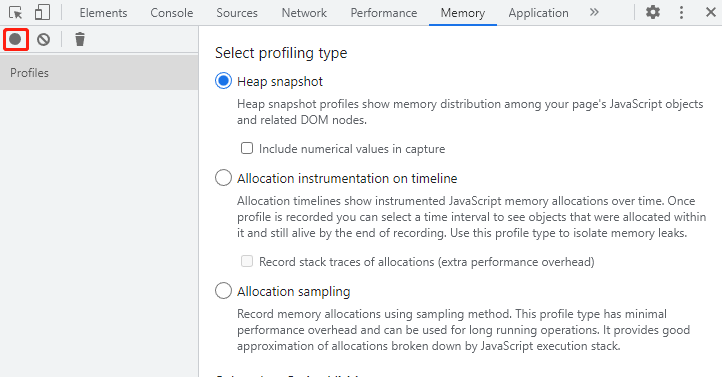
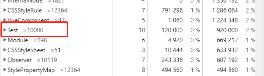

# 一次内存泄漏排查过程

## 起因

某天收到用户反馈，说有个页面重复进入多次后浏览器会变得越来越卡最后直接崩溃了，然后我打开该页面重现该问题，确实如用户所说多次进入该页面后浏览器最后崩溃了，第一时间想到了可能发生了内存泄漏，打开控制台的 `Memory` 面板能发现每次退出页面，该页面所占用的内存未释放，确认了我的猜想。

## 排查

确认了问题就到了解决问题的时候了，该项目使用的是 Vue 技术栈，第一时间看看该页面路由对应的组件是否有未卸载事件或未清除的定时器，导致该组件卸载后组件实例未释放，我以为马上就能揪出问题的元凶，但实际上并没有发现前面提到的事件或定时器。

没有发现凶手，但确实组件卸载后实例未释放，我开始把目光放到了 Vue 身上，试图在它身上找到什么线索

我开始在 Vue 官方库的 Issue 上查找关于内存泄漏的相关问题，确实有类似的提问，但官方的回复都是请检查自己的代码是否有问题，Vue 本身不是导致这个问题的元凶

Vue 有没有问题很好验证，起一个 demo 测试一下就知道了，我得到的答案是 Vue 组件在卸载后会释放该组件实例占用的内存，Vue 的嫌疑也排除了，后来想想也是，Vue 不可能存在这么大的漏洞，但我还是觉得需要验证之后才能确定

该页面路由对应的组件本身没有导致内存泄漏的代码，Vue 的嫌疑也排除了，那么问题到底出在哪里呢，我陷入了沉思...

当我在看着 Vue 实例对象思考问题根源的时候，我突然注意到了一个不经意的细节上，在人群中发现了那个可疑的对象


~~真相只有一个，那就是...（误~~

引起我注意的是 Vue 实例对象的 parent、children 属性，这两个属性保存着该组件实例的父、子组件实例的引用，这意味着只要有一个子组件实例没有得到释放，那么整颗组件树所占用的内存都不会被释放，这个细节被我遗漏了


*图片引用自 Vue 官网*

图中的组件树任意一个节点实例对象没有销毁都会导致整颗树所占用的内存无法释放

我马上开始排查该页面使用到的子组件，果然在某个组件中发现了导致内存泄漏的元凶，也就是未卸载的事件，将这个凶手处理完之后一切都恢复正常了

## 查看内存使用

最后说下如何确认组件卸载后组件实例所占用的内存是否得到释放

首先生成一些数据存到组件实例中

```javascript
class Test {}

export default {
  data() {
    return {
      list: Array.from({ length: 10000 }, () => new Test())
    }
  }
}
```

然后打开chrome浏览器控制台的 `Memory` 面板，点击左上角按钮生成一次内存快照，能看到有该组件保存的 Test 实例对象





最后卸载该组件后点击垃圾桶按钮主动进行一次内存回收，再生成一次内存快照查看该 Test 实例对象是否被释放，正常情况下该组件实例所占用的内存已经被回收了
